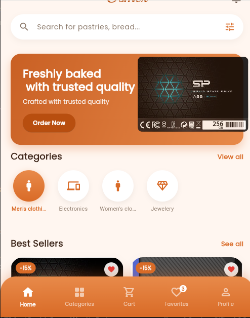
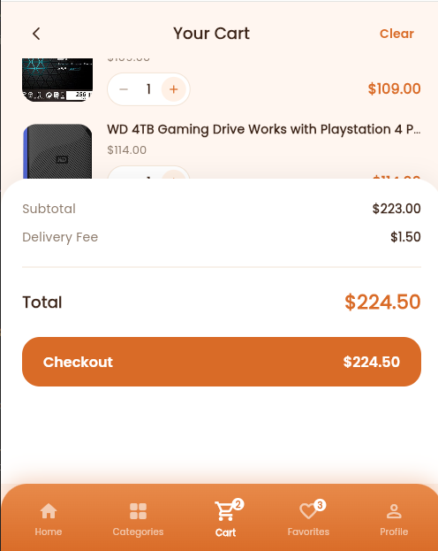
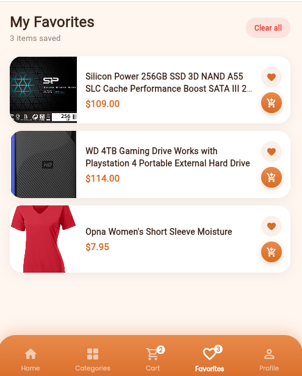

# 🛒 Osmex Commerce App

A modern and scalable e-commerce application built using **Flutter**, designed with clean architecture principles and a smooth user experience across mobile and web platforms.

---

## 🚀 Features

- 🛍️ Product browsing and categorization  
- 🔍 Advanced search functionality  
- ❤️ Wishlist management  
- 🛒 Shopping cart system  
- 🔐 User authentication  
- 💳 Checkout flow  
- 📱 Responsive UI for mobile and web  
- ⚡ Optimized performance and clean architecture  

---

## 🧱 Tech Stack

- **Flutter**
- **Dart**
- **Firebase**
- **REST API**
- **Provider / Bloc / Riverpod**

---

## 📸 Application Screenshots

<table>
  <tr>
    <td align="center">
      
      <br/>
      <b>Home Screen</b>
    </td>
    <td align="center">
      
      <br/>
      <b>cart Screen</b>
    </td>
  </tr>-screen

  <tr>
    <td align="center">
      
      <br/>
      <b>Cart Screen</b>
    </td>
    <td align="center">
      
      <br/>
      <b>Profile Screen</b>
    </td>
  </tr>
</table>

---

## 📁 Project Structure

```bash
lib/
 ├── core/
 ├── features/
 │    ├── auth/
 │    ├── products/
 │    ├── cart/
 │    ├── profile/
 ├── shared/
 └── main.dart
